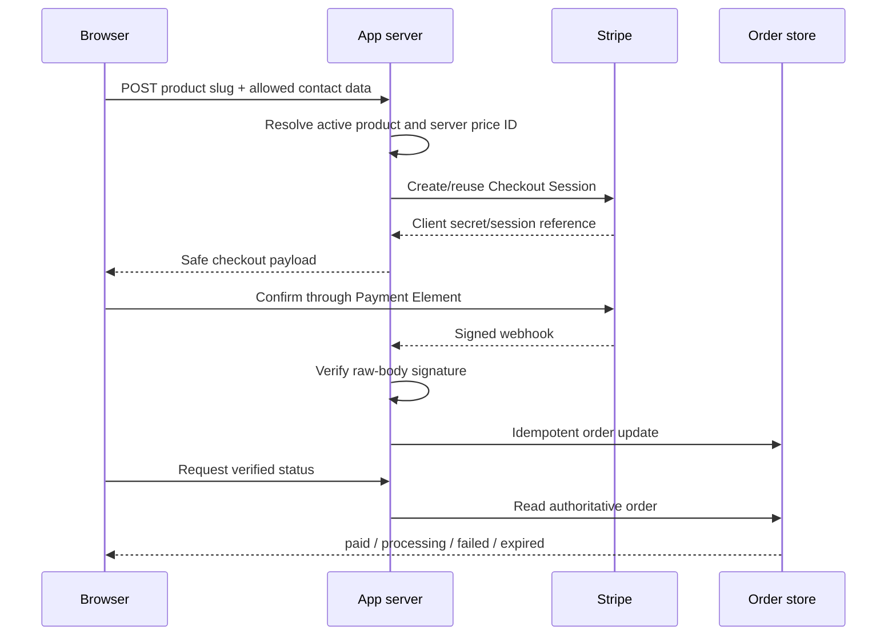

# Checkout and payment result

Routes: `/checkout/[slug]` and `/checkout/success`

## Job of the flow

Make the offer, amount, payment state, and next step unmistakable while keeping all pricing and payment authority on the server.

## Payment architecture

## Checkout page wiring

| Component | Authority/input | Action | State behavior |
| --- | --- | --- | --- |
| `CheckoutHeader` | product name and secure-flow copy | back to product | preserve session where safe |
| `ExpressCheckout` | provider-reported eligible methods | provider action | render only when actually available |
| `ContactFields` | shared validated schema | update contact | retain on recoverable failure |
| `PaymentElement` | server-created client secret | provider-controlled | loading, ready, provider error |
| `OrderSummary` | server product and server amount | none | sticky desktop, in-flow mobile; amount/cadence adjacent |
| `PayButton` | provider readiness and exact formatted total | confirm | idle, processing, disabled reason |
| `SupportLink` | verified contact config | contact | always available without blocking payment |

## Conversion pattern

- Desktop: payment form left, concise sticky order summary right. Mobile: summary before payment fields, followed by one full-width pay button.
- Express methods may appear before the card form with a neutral “of betaal met kaart” divider, but only when Stripe reports them.
- Show included items, final total, currency, tax treatment if applicable, billing cadence, and a legal acknowledgement near confirmation.
- Do not add fake security badges, timers, low-stock claims, preselected add-ons, or surprise fees.
- Suppress the global intake CTA throughout checkout.

## Configuration and failure states

- `configuration_required`: product or Stripe Price ID missing; explain availability and route to intake/contact. Do not mount a live-looking payment form.
- `creating_session`: skeleton matching the payment form geometry.
- `ready`: Payment Element mounted and pay control enabled.
- `processing`: lock duplicate submission and announce status accessibly.
- `recoverable_failure`: show safe provider message, retain the form, permit retry.
- `terminal_failure` or expired session: create a new server session after user confirmation.

## Success route wiring

The success route may receive a provider session reference, but the query string is never proof of payment. The server retrieves or reads the normalized order and renders:

| Verified state | Page message/action |
| --- | --- |
| paid | confirmed purchase details plus `Vul mijn intake in` |
| processing | payment processing; safe refresh/poll with a limit and support path |
| unpaid/failed | no success language; return to checkout or contact support |
| expired/unknown | explain that confirmation is unavailable; no entitlement granted |

Trainerize enrolment is a separate post-purchase step until a supported integration is confirmed. Do not promise automatic access.
