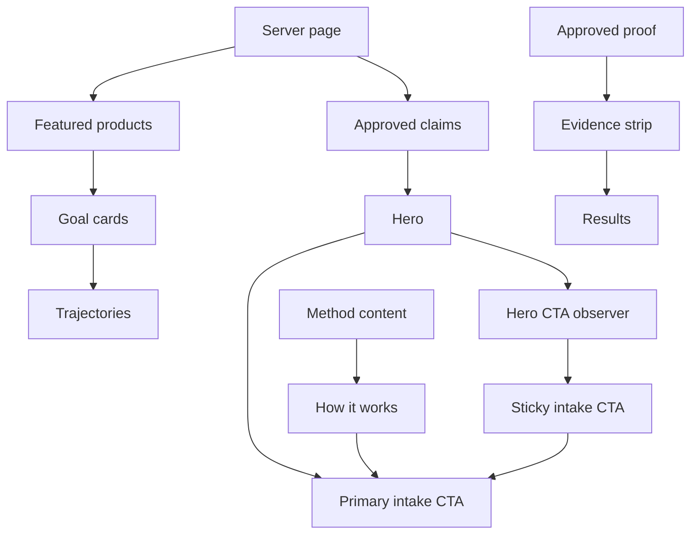

# Home — `/`

## Job of the page

Turn a first-time visitor from “is this for me?” into one low-friction next step: an intake. Secondary paths provide proof, explain the offer, and let a visitor self-select a trajectory without competing with the primary CTA.

## Component and data wiring

## Section wiring

| Order | Section/component | Data source | Main control | Destination/side effect | Required states |
| --- | --- | --- | --- | --- | --- |
| 1 | `SiteHeader` | route config | logo, Trajecten, Resultaten, Over Omar, tools, intake | internal routes | desktop, mobile menu open/closed, keyboard focus |
| 2 | `HomeHero` | approved hero copy and canonical coach photo | `Plan een intake` | `/intake?source=home-hero` | image loading/fallback, CTA visible |
| 3 | `ProofStrip` | approved numeric claims only | optional `Bekijk resultaten` | `/resultaten` | hide unverified claims, never replace with invented values |
| 4 | `GoalSelector` | active featured products | goal/product cards | `/trajecten?doel=<allowed-key>` or product route | loaded, no featured products, inactive product |
| 5 | `HowItWorks` | approved method copy | `Plan een intake` | `/intake?source=home-method` | default |
| 6 | `ResultPreview` | verified result/testimonial records | `Bekijk resultaten` | `/resultaten` | verified records, honest empty state |
| 7 | `CoachPreview` | approved biography and portrait | `Ontmoet Omar` | `/over-omar` | image fallback |
| 8 | `FinalIntakePanel` | approved CTA copy | `Plan een intake` | `/intake?source=home-final` | observed/unobserved for sticky CTA suppression |
| 9 | `SiteFooter` | verified contact/legal config | contact and legal links | `/contact`, `/privacy`, `/voorwaarden`, `/cookies` | missing contact fields omitted |

## Sticky first-CTA contract

- Keep the real hero CTA in normal document flow.
- Observe the hero CTA and the final CTA; do not trigger from an arbitrary scroll distance.
- Show the sticky CTA only after the hero CTA leaves the viewport and while the final CTA is not visible.
- Enter from `y: 24` and `opacity: 0` to `y: 0` and `opacity: 1` in about 320 ms.
- Hide on `/intake`, `/checkout/*`, and success/pending payment screens.
- Use the implementation in `motion/sticky-intake-cta-motion.tsx`, or the GSAP alternative when the host project already uses GSAP. Never ship both for this behavior.
- With reduced motion, change visibility without translation. Preserve a mobile safe-area gap and never cover the footer or form controls.

## Conversion and responsive rules

- One lime-filled primary action per viewport; secondary controls use text or outline treatment.
- The hero must state audience, outcome, and mechanism before any feature list.
- Mobile order is eyebrow → headline → concise proof/value → CTA → coach image.
- Do not turn campaign posters into hero backgrounds. Use a clean approved photo with HTML copy over a controlled dark surface.
- Carry only a small `source` identifier to intake analytics; never place private form data in the URL.
