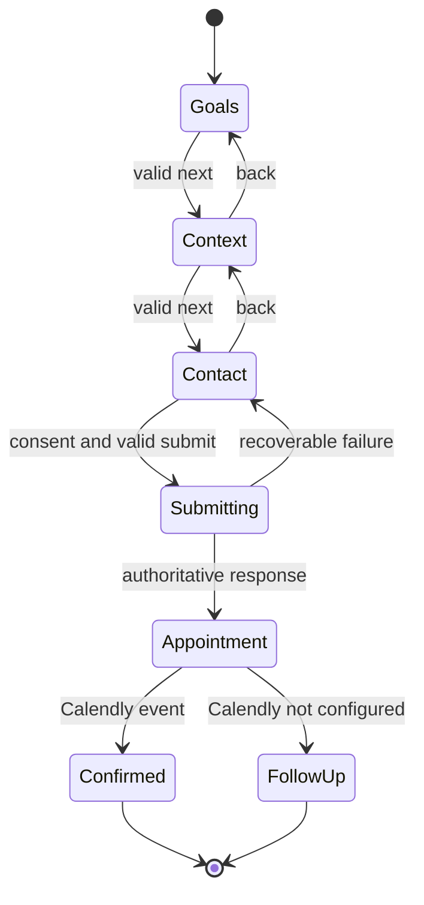

# Intake — `/intake`

## Job of the page

Collect enough information for a useful first conversation without turning the form into a medical questionnaire or creating a false promise that the intake is free.

## Flow architecture

## Recommended step wiring

| Step | Purpose | Suggested fields | Validation/action |
| --- | --- | --- | --- |
| 1 — Doel | identify the visitor’s intent | one primary goal, experience level | required allow-list values; `Volgende stap` |
| 2 — Context | understand practical fit | preferred format, availability range, optional short note | do not request diagnoses; `Vorige` / `Volgende stap` |
| 3 — Contact | enable follow-up | name, email, optional phone, preferred contact channel, consent acknowledgement | server-validated; `Ga door naar datum & tijd` |
| 4 — Afspraak | schedule or explain the next step | Calendly inline booking when configured; stored-reference fallback otherwise | never claim confirmation before a Calendly event |

Final field names, retention period, processor list, consent language, and destination require privacy/legal approval before production.

## Data and submission wiring

1. Initialize only allowed `product` and `source` query values; reject arbitrary values.
2. Keep the multi-step draft in component/form state. If draft recovery is added, use short-lived session storage and exclude sensitive free text where possible.
3. Validate per step and again on the server with the same schema.
4. POST to `/api/intake`; the endpoint persists or forwards only to an approved destination.
5. Return a stable success identifier and an optional approved scheduling URL. Do not claim a booking is confirmed unless Calendly confirms the event.
6. On failure, retain values, focus an error summary, and offer verified contact details.

## UX states

- `pristine`, `step-invalid`, `step-valid`, `submitting`, `submitted`, and `recoverable-error`.
- Persistent labels, group labels for choice cards, inline errors, and a top error summary.
- Progress text such as “Stap 1 van 4”; never imply time-to-complete without measurement.
- Back navigation preserves values. Browser refresh behavior must be explicit and tested.
- Session recovery persists only structured, non-sensitive fields; free text and consent are deliberately excluded.
- Submission button disables during the request and guards against duplicate submissions.

## Conversion guardrails

- Use “Plan een intake” until the client confirms it is free.
- Explain what happens after submission in one sentence and use only a verified response-time claim.
- No prechecked marketing consent and no bundled consent.
- `/intake` suppresses the global sliding CTA so the form remains the sole primary action.
