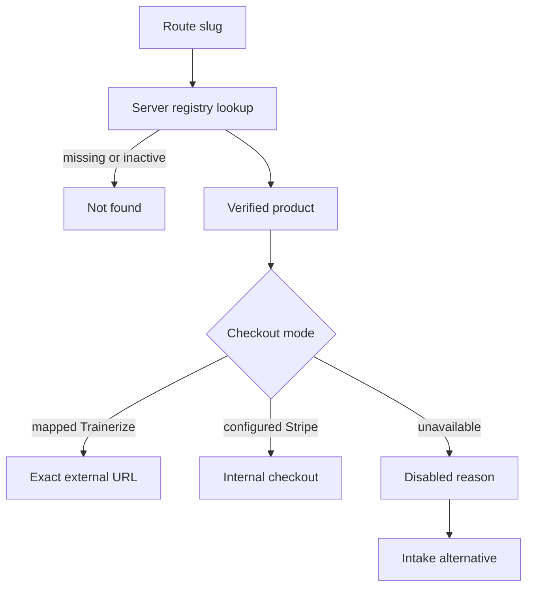

# Product detail — `/trajecten/[slug]`

## Job of the page

Convert a visitor who has selected an offer while preventing incorrect plan links, invented pricing, or a fake checkout path.

## Resolution architecture

## Section wiring

| Order | Component | Data | Control | Result |
| --- | --- | --- | --- | --- |
| 1 | `ProductHero` | name, audience, verified promise, canonical art | `Start mijn traject` | action resolver below |
| 2 | `OutcomeGrid` | approved outcomes | none | semantic list; no guaranteed results |
| 3 | `IncludedList` | verified inclusions | none | omit uncertain features rather than infer them |
| 4 | `MethodTimeline` | verified delivery steps | none | training/onboarding sequence |
| 5 | `FitCheck` | suitable/not-suitable copy | intake link | `/intake?product=<slug>&source=product-fit` |
| 6 | `PriceAndAction` | publishable price and checkout status | primary start, secondary intake | exact action mode |
| 7 | `RelatedProducts` | active registry entries | view another product | other product route |

## Start-action resolver

| Condition | Label | Action |
| --- | --- | --- |
| `trainerize_external` and verified plan mapping | `Bekijk programma` | navigate to the exact registry URL; never construct a GUID client-side |
| `stripe_internal` and Stripe Price ID configured | `Veilig betalen` | `/checkout/[slug]`; server determines amount |
| price or mapping unresolved | `Nog niet beschikbaar` | disabled with visible reason plus `Plan een intake` |

## Conversion details

- Place one concise objection-handling line beside the primary action: what happens next, not a vague trust claim.
- Keep the final price and billing cadence together. Never separate a recurring cadence from the amount.
- Do not use scarcity, crossed-out prices, risk-free promises, guarantees, or review totals unless the client supplies verifiable evidence and terms.
- On mobile, the final action panel may become sticky only when it does not compete with the global intake CTA; product pages should use one sticky action system.

## Error handling

- Unknown slug: real 404 with `Bekijk trajecten`.
- Product inactive after navigation: availability notice and intake path.
- External URL rejected by allow-list: disable action and log configuration error server-side.
- Stripe configuration missing: do not create a mock paid state; keep checkout inaccessible.
