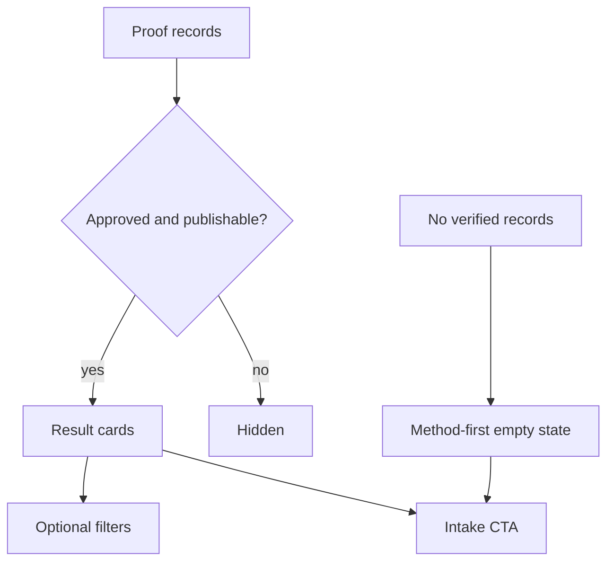

# Results — `/resultaten`

## Job of the page

Reduce perceived risk with attributable, permissioned evidence—without manufacturing transformation imagery, metrics, or endorsements.

## Data wiring

## Section wiring

| Order | Component | Required data | Action/state |
| --- | --- | --- | --- |
| 1 | `ResultsHero` | conservative approved headline | intake CTA |
| 2 | `ProofSummary` | verified aggregate only | omit entirely if not substantiated |
| 3 | `ResultGrid` | consent, display name/initials, context, quote, date/source, media permission | cards; optional approved filters |
| 4 | `MethodBridge` | approved explanation of coaching process | product/intake links |
| 5 | `FinalIntakePanel` | global CTA copy | `/intake?source=results` |

## Proof contract

- Each record needs internal provenance and publication permission; the UI does not need to expose private provenance fields.
- Before/after media requires explicit use permission and consistent presentation. Never synthesize a client transformation.
- Quotes must remain faithful to source. Light spelling corrections require approval; no fabricated names or review-platform attribution.
- Results must be framed as individual outcomes, not guaranteed expectations.
- Current-site testimonials and numeric claims stay marked unverified until the client provides source/approval.

## Empty and error states

- With no approved proof, show the method, what is measured, and an intake action; never insert stock testimonials.
- Data failure is different from “no results”: show a recoverable error and keep contact/intake available.
- Images use useful alt text when they communicate evidence; decorative gym imagery uses empty alt text.
