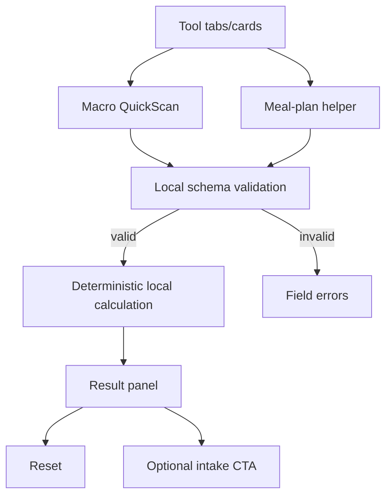

# Free tools — `/gratis-tools`

## Job of the page

Deliver immediate, transparent utility and create an optional bridge to coaching. Tool results are estimates, not diagnoses or guaranteed outcomes.

## Component wiring

## Tool contracts

| Tool | Inputs | Processing | Output | Persistence |
| --- | --- | --- | --- | --- |
| Macro QuickScan | client-approved demographic/activity inputs | documented deterministic formula | estimated range plus assumptions | none by default |
| Meal-plan helper | preferences, constraints, goal category | rule-based template selection | sample structure, not medical nutrition therapy | none by default |

Exact formulas, eligible users, exclusions, copy, and nutrition/legal review must be approved before production. Do not quietly invent a proprietary score.

## States and actions

- `pristine`: clear explanation and start control.
- `invalid`: persistent labels, inline messages, focused error summary.
- `calculated`: assumptions, units, result range, limitations, reset, and optional intake CTA.
- `reset`: clear all local values and result state.
- No server POST, lead capture, or analytics payload containing tool answers without separate consent and documentation.

## Safety and conversion rules

- Do not accept or interpret diagnoses, eating-disorder history, pregnancy, medication, or other health data in this lightweight tool.
- Use a conservative “indicatie” framing and avoid prescriptive medical language.
- The coaching CTA follows the result and stays secondary to the promised utility.
- Do not gate the result behind email capture in this phase.
