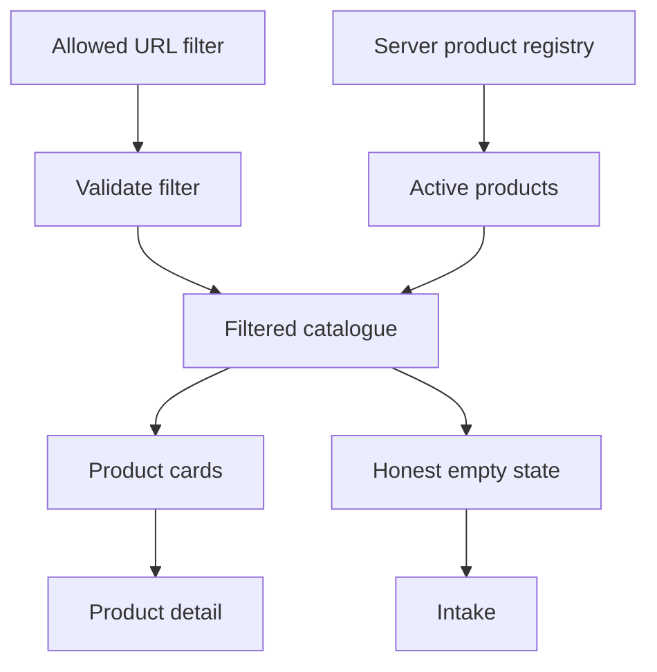

# Trajectories — `/trajecten`

## Job of the page

Help visitors identify the right format quickly, compare only verified facts, and choose between a product detail page and a consultative intake.

## Component and data wiring

## Section wiring

| Order | Component | Input | Action | Output/state |
| --- | --- | --- | --- | --- |
| 1 | `CatalogueHero` | approved positioning copy | intake CTA | `/intake?source=trajecten-hero` |
| 2 | `CategoryTabs` | fixed allow-list derived from registry | filter | updates `?categorie=` with an allowed key; all-products fallback |
| 3 | `ProductGrid` | server-filtered active products | select card | product detail route |
| 4 | `ProductCard` | name, verified summary, image, tags, price status | `Bekijk traject` | `/trajecten/[slug]` |
| 5 | `ComparisonHelp` | approved selection guidance | intake CTA | `/intake?source=trajecten-help` |
| 6 | `SiteFooter` | global config | contact/legal | canonical routes |

## Product-card truth rules

- Render a price only when `priceStatus` is publishable. Otherwise use neutral copy such as “Prijs na bevestiging”; do not use “vanaf” without a real minimum.
- A mapped Trainerize URL is not exposed on catalogue cards. Product details resolve the correct start action.
- Inactive or unmapped products may be explained but cannot show a working purchase action.
- Preserve supplied capitalization where it is a product name; keep interface copy in Dutch.

## States and responsive behavior

- Unknown URL filter: normalize to all products without throwing.
- Valid filter with zero active products: explain that no verified offer is available and provide intake/contact.
- Registry load failure: show a recoverable page error; do not render an empty grid as if the catalogue were genuinely empty.
- Desktop: 3-column grid where content length allows. Tablet: 2 columns. Mobile: 1 column, with filter tabs horizontally scrollable only if focus visibility and scroll affordance remain clear.
- The product image is supportive; the card name, audience, format, and action remain semantic HTML.
